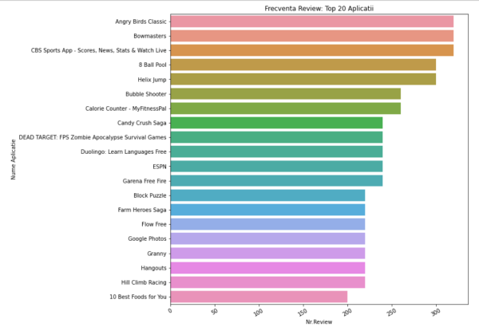
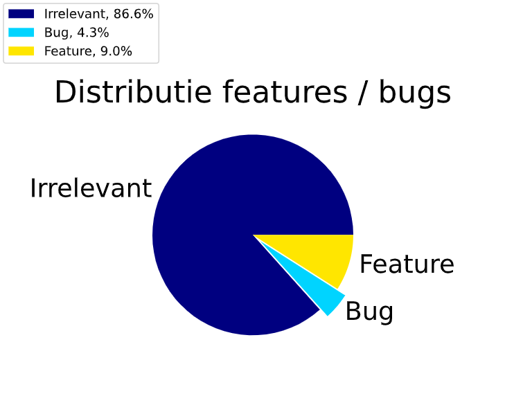
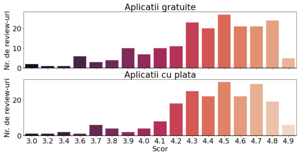
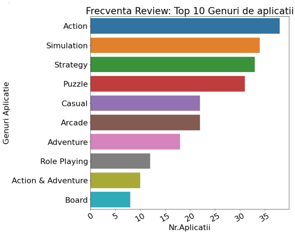
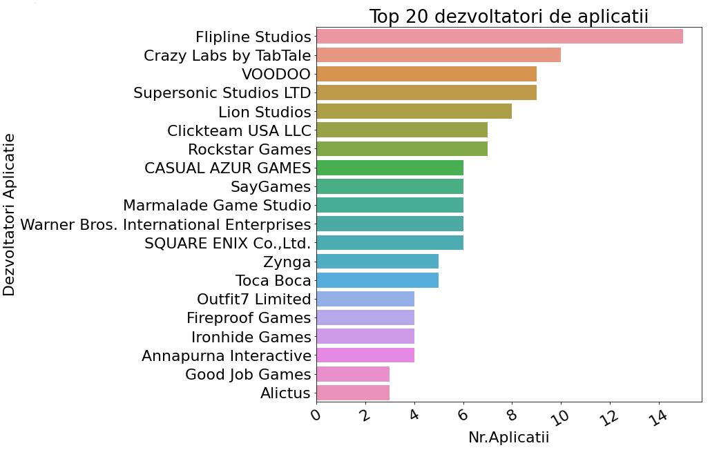
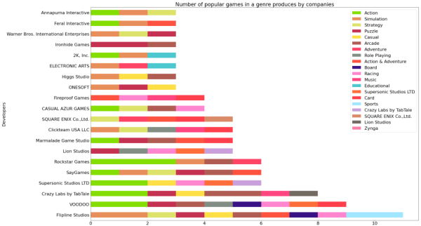

# Mobile_Games_Customer_Satisfaction
Sigmoid **The Dons** Final Project
## General Info
Mobile Apps Market is overwhelmed with games. Even more so - overwhelmed with customer reviews for the games. On average 629 apps are released daily on the App Market. From that 14.2% are in the games category on the PlayMarket. For a developer it is difficult to extract useful data from this amount of information. Our research will ease their jobs by categorizing the reviews not only by user satisfaction, but specific indices such as bugs and features, that can then be used to rate the success of the game and predict its longevity.

For more information about the mobile game market please consult our [Business Intelligence Research](https://drive.google.com/drive/folders/1n2A04Z0OhfP9Vbb8u-E-JLzMkaqhPSTW?usp=sharing).

This study researches sentiment analysis for Play Marker game apps. The goals of the study are:
* Build a predictive analytics model to identify critical issues such as bugs, features and “irrelevant” data in real time
* Understand game satisfaction trends
* Analyze game reviews and classify the sentiment of the review into positive, negative, neutral

### Scraping
This project analyzes and classifies the sentiment on a [dataset from kaggle](https://www.kaggle.com/lava18/google-play-store-apps?select=googleplaystore_user_reviews.csv). 
We trained and then tested on a dataset scrapped from Google Play Market with the help of [Google Play Scraper Library](https://github.com/facundoolano/google-play-scraper#reviews).
The labeling of the data into bugs and features was done manually on 5000 items from the scrapped dataset.

### Exploratory Data Analysis
#### Top 20 applications with most reviews 

#### Features & bugs PyChart

#### Overall score distribution for free and paid apps

#### Popular genres produced by game companies

#### Top 20 game developers

#### Number of popular games in a genre produced by companies

### Preprocessing Data
 * Data cleaning - spell checking and removing punctuation, stop words and hapaxes
 * Stemming
 * Tokenization

## Model Training and Result Comparison
### Random Forest Classifier
- accuracy_score(y_test, y_pred)
- output: 0.87
### CatBoost Classifier
- accuracy_score(y_test, y_pred)
- Output: 0.97
### VotingClassifier
- accuracy_score(y_test, y_pred)
- Output: 0.92

## Technologies
### JavaScript Libraries 
* Play Market Scraper
### Python Libraries 
* included in the requirement.txt document

## Setup
1. Install python virtual environment (conda)
2. Run in the shell `pip install -r requirements.txt`  to install all necessary libraries.
3. Open the setup.py, change the value of X to your desired input and run the script.
4. You will get one of the following texts: irrelevant = 0, bug = 1 or feature = 2
